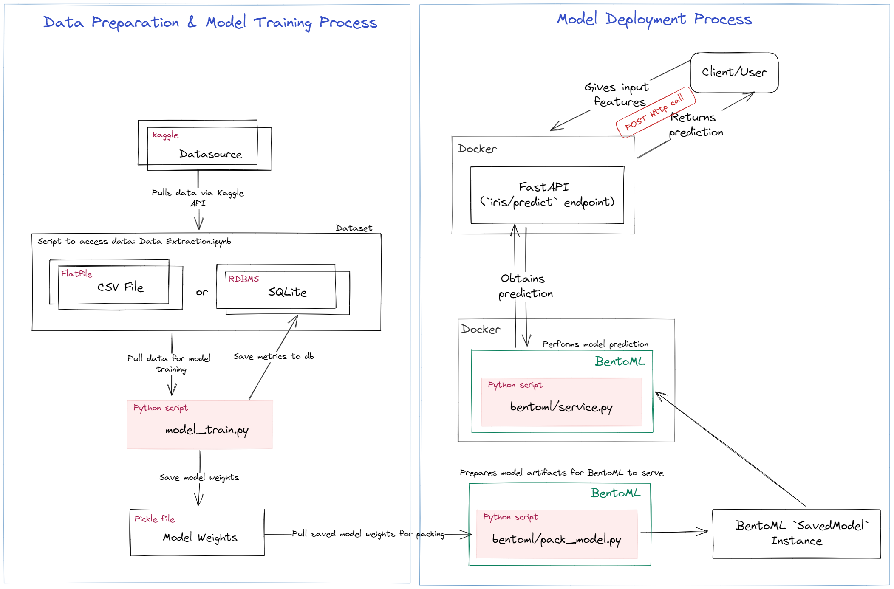
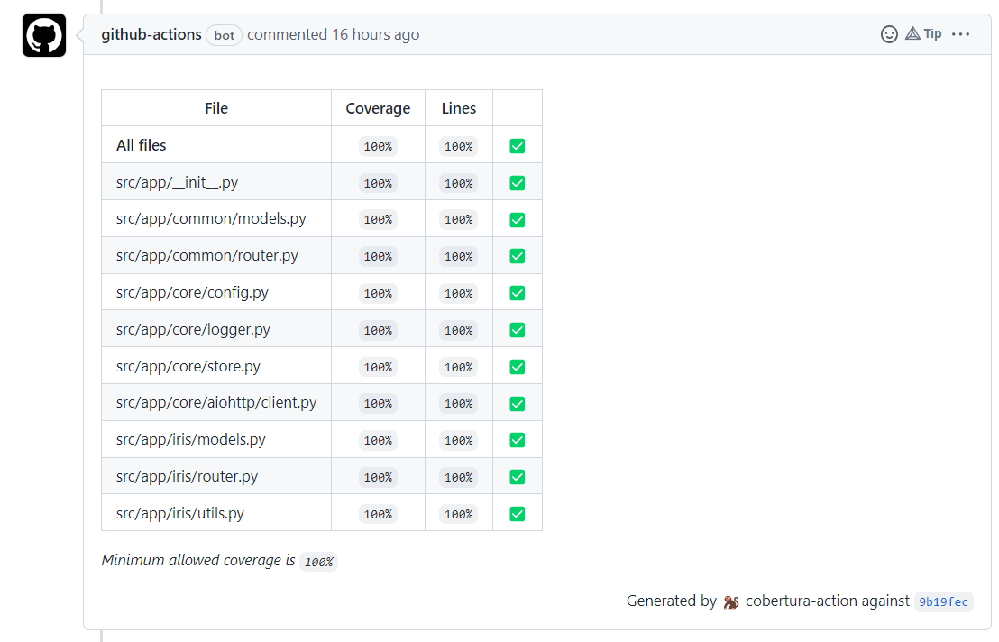
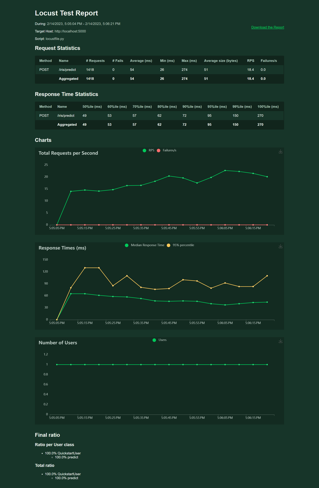
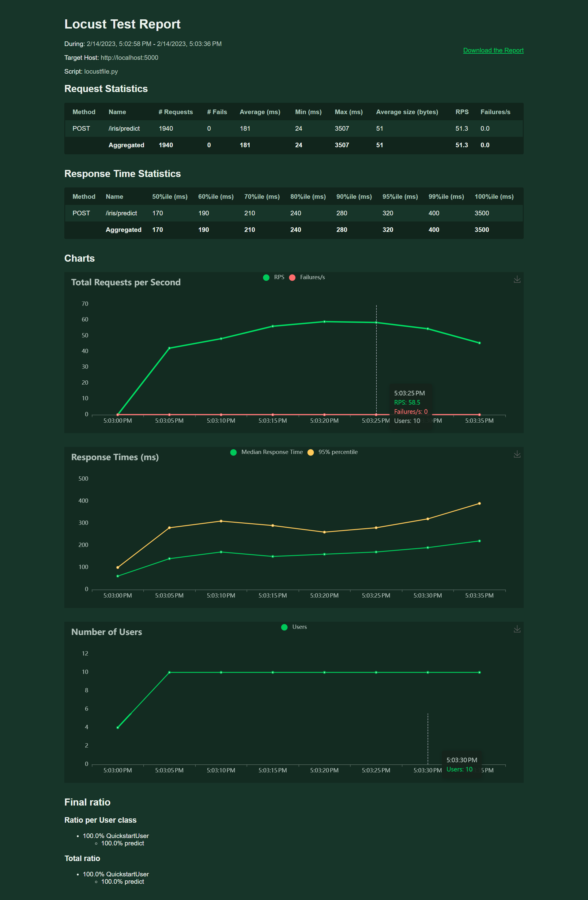

# Machine Learning Model Development & Deployment - Iris Dataset

This repository contains the codebase for machine learning model training and deployment using the [Iris dataset](https://www.kaggle.com/datasets/uciml/iris).
- Goal of the machine learning model is to predict the species of the Iris Flower based on the flower's features such as `Sepal Length`, `Petal Width` and `Petal Length`.
- ML Model is then deployed as a microservice (i.e. POST endpoint) for real-time inference.

## Components of Application



## Model Training
Aim: Predict the species of the flower based on the given features such as petal length and sepal width
Problem Type: Classification
- Number of rows: 150
- Number of classes: 3 (`Iris-setosa`, `Iris-versicolor`, `Iris-virginica`)
- Number of features: 4 (`Sepal Length`, `Sepal Width`, `Petal Width` and `Petal Length`)

### Choice of model
As the aim of the repository is to dive deeper into machine learning model deployment (with some aspects of model development), only 1 machine learning model was tested - i.e. logistic regression.

It is also notable that the Iris dataset is rather small, with balanced classes and only 4 features. Hence, the logistic regression model worked well and achieved an accuracy score of: `0.947` on the test set.

Some exploratory data analysis can be found in: [`Model Development.ipynb`](/model_training/notebooks/Model%20Development.ipynb)

### Choice of metrics
For this problem, as the main aim is to correctly predict the species and since the dataset has balanced classes, accuracy will be used as the main metric.
- Accuracy = True Positive / Total number of Samples
- If the dataset becomes unbalanced in the future or if greater weightage is placed on False Negatives/Positives, other metrics like recall and F1 score can be included.


### Model Training - Pipeline
Over time, the data could be refreshed with new inputs and the model can be retrained for improved performance. Such training jobs can be orchestrated via tools like Airflow.

To handle model training and versioning, the [`model_train.py`](/model_training/pipelines/model_train.py) code was compiled to include:
1. Train test split of dataset that is stratified by class - this will ensure that all classes are seen by the model during the training process
2. Fitting of chosen model with train data (in this case, the chosen model is logistic regression)
3. Obtain metrics model using test data (i.e. accuracy score)
4. Push metrics, model name and timestamp into database (i.e. sqlite db)
5. Save model weights as pickle file, with naming convention following the database for ease of future tracing


## Model Deployment
For this deployment, BentoML and FastAPI was used.
- BentoML: Takes care of model prediction, via HTTP POST request, with adaptive batching for improved performance
- FastAPI: Handles client calls via HTTP POST request, data validation using pydantic models and error handling (should the BentoML endpoint fails)

### Testing

#### Unit Testing
To ensure that the application code is robust and working as intended, unit testing was done for the FastAPI application. These tests can be found in the `tests` folder. 100% coverage is also required for the FastAPI application code and this is checked by the [CI Github Actions pipeline](/.github/workflows/ci.yaml) before a pull request can be merged to the `main` branch.

Additionally, the CI pipeline also checks for linting using flake8.



#### Load Testing
Simple load testing was also done for the FastAPI endpoint to measure performance and ensure that it can return predictions at higher loads. The load test was performed at:
1. max 1 concurrent user (i.e. ~18 RPS)
2. max 10 concurrent users at 3 user/s spawn rate (i.e. ~50RPS)

A local machine with 8GB RAM and 512GB memory was used to deploy the application and perform the load test.

Code that was used in load test can be found in: [locustfile.py](/loadtest/locustfile.py). To perform the loadtest, the following command can be run:
```
cd loadtest
locust
```

Below are the results:
| Max 1 concurrent user (i.e. ~18 RPS) |  Max 10 concurrent users at 3 user/s spawn rate user (i.e. ~50 RPS) |
:-------------------------------------:|:-------------------------------------------------------------------:|
  |  

### Dockerisation of application
For ease of deployment via orchestration tools like Kubernetes, the endpoints were also dockerised into images. 2 images were created, namely:
1. BentoML model prediction endpoint [DockerHub link](https://hub.docker.com/r/ballchuuu/iris_model_deployment/tags)
2. FastAPI endpoint [DockerHub link](https://hub.docker.com/r/ballchuuu/iris_FastAPI/tags)

To build the docker files, the following commands were used:
1. BentoML model prediction endpoint
```
cd src/bentoml
bentoml build
bentoml containerize iris_model:latest -t iris_model_deployment:latest
```
2. FastAPI endpoint
```
docker build -f Dockerfile.fastapi -t iris_fastapi:latest .
```

## Instructions to run the application
### Set up environment
This respository is using [poetry](https://python-poetry.org/) to manage package dependencies.
To view the python version and packages used in this repository, you can view [pyproject.toml](pyproject.toml)

To install the packages, you can run the following:
```
python -m pip install --upgrade pip
pip install poetry
poetry install
```

### Local  Development
1. Run BentoML:
```
cd src/bentoml
bentoml serve
```
To access the docs, you can go to `http://localhost:3000`

2. Run the FastAPI app:
```
cd src
uvicorn app.main:app --reload
```
To access the api docs locally, you can go to `http://localhost:8000/docs`

3. To perform the prediction, other than using the api docs, a curl request can be sent via HTTP POST to the FastAPI app.
```
curl --location --request POST 'http://localhost:8000/iris/predict' --header 'Content-Type: application/json' --data-raw '{"SepalLengthCm": 5,"SepalWidthCm": 2,"PetalLengthCm": 3,"PetalWidthCm": 4}'
```

Sample response
```
{"output":"Iris-virginica","model_name":"log_reg_1"}
```

### Docker Deployment
1. Run BentoML:
```
docker pull ballchuuu/iris_model_deployment:latest
docker run -it --rm -p 3000:3000 iris_model_deployment:latest serve --production
```

2. Run FastAPI App:
```
docker pull ballchuuu/iris_fastapi:latest
docker run -it --rm -p 5000:5000 iris_fastapi:latest
```

3. To perform the prediction, other than using the api docs, a curl request can be sent via HTTP POST to the FastAPI app.
```
curl --location --request POST 'http://localhost:5000/iris/predict' --header 'Content-Type: application/json' --data-raw '{"SepalLengthCm": 5,"SepalWidthCm": 2,"PetalLengthCm": 3,"PetalWidthCm": 4}'
```

Sample response
```
{"output":"Iris-virginica","model_name":"log_reg_1"}
```

## Directory
```bash
├── .github
│   ├── workflows
        └── ci.yaml # GitHub Actions CI pipeline
    ├── CODEOWNERS
    └── pull_request_template.md # template to follow for pull request
├── data
    ├── database.sqlite # sqlite db that contains model training metrics and iris dataset
    └── Iris.csv # CSV file of iris dataset
├── imgs # contains images used in this ReadMe
├── loadtest # contains code for loadtest
    └── locustfile.py
├── model_training
    ├── notebooks # jupyter notebooks used for experimentation
        ├── Data Extraction.ipynb
        └── Model Development
    └── pipelines
        ├── model_train.py # main model training code
        └── utils.py
├── src # main codebase for FastAPI
    ├── app
        ├── common # contains common endpoints (i.e. `/` and `/healthz`)
            ├── models.py
            └── router.py
        ├── core # contains core functions used throughout the app
            ├── aiohttp
                └── client.py # initialise aiohttp client session for use throughout the app
            ├── config.py
            ├── store.py # used to initialise any clients on app start up
            └── logger.py
        └── iris # contains main `POST` endpoint for Iris model prediction
            ├── models.py
            ├── router.py
            └── utils.py
        └── main.py # entrypoint for FastAPI
    └── bentoml
        ├── assets # model weights are stored here
            └── log_reg_1.pkl
        ├── bentofile.yaml # defines the bento service
        ├── config.py
        ├── pack_model.py # used to pack pkl model weights to SavedModel instance
        └── service.py # define main model prediction service
├── tests # test cases for FastAPI app
├── .flake8 # linting requirements
├── .gitignore
├── .pre-commit-config.yaml # precommit hooks used
├── Dockerfle.fastapi # Dockerfile for FastAPI application
├── poetry.lock
├── pyproject.toml
└── README.md
```

## Future Work
Some future work that would like to be explored:
1. Perform some feature engineering and explore more models other than logistic regression
2. Improvements to model training pipeline to include model quality checks
3. Add on model monitoring and observability functions for FastAPI and BentoML endpoints
